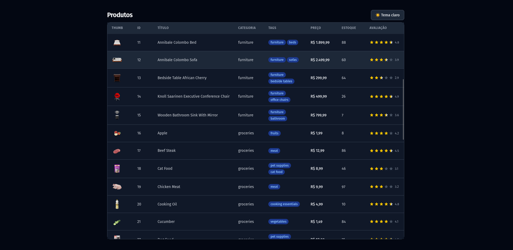
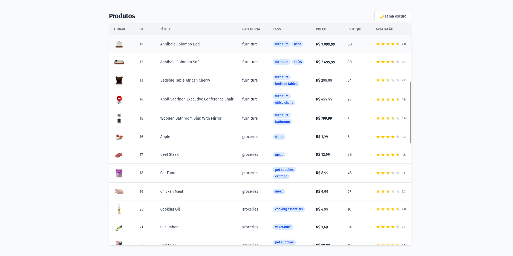

# poc-tanstack-table

POC desenvolvida para avaliar o [TanStack Table](https://tanstack.com/table/latest) como alternativa ao Tabulator.js — biblioteca que utilizava antes, mas que não oferece suporte nativo a paginação infinita de forma prática. Após a pesquisa, o TanStack Table foi adotado no projeto.

A POC demonstra uma `DataTable` genérica, reutilizável e extensível — com células customizadas, pinning de colunas, infinite scroll via diretiva Vue customizada e tema claro/escuro.

<div align="center">


</div>

## Screenshots

| Tema escuro | Tema claro |
|-------------|------------|
|  |  |
---

## Funcionalidades

- `DataTable` genérica com tipagem TypeScript via generics
- Células customizáveis via componentes Vue injetados por coluna
- Pinning de colunas (esquerda e direita)
- Infinite scroll com diretiva Vue customizada (`v-scroll-end`)
- Paginação progressiva via `useInfiniteQuery` do TanStack Query
- Coluna de ações configurável por linha
- Tema claro/escuro com toggle manual

---

## Stack

| Tecnologia | Versão | Uso |
|------------|--------|-----|
| Vue 3 | ^3.5.13 | Framework principal |
| TanStack Table | ^8.21.3 | Engine da tabela |
| TanStack Query | ^5.92.9 | Cache e fetching com paginação infinita |
| TypeScript | ~5.8.3 | Tipagem estática |
| Tailwind CSS v4 | ^4.2.1 | Estilização |
| Axios | ^1.13.6 | HTTP client |
| Vite | ^6.3.5 | Build tool |

---

## Estrutura do projeto

```
src/
├── api/
│   ├── http.ts                  # Instância do Axios (baseURL: dummyjson.com)
│   ├── products.service.ts      # useInfiniteProducts com TanStack Query
│   └── types/
│       └── product.ts           # Interface Product e ProductsResponse
│
├── components/
│   └── DataTable/
│       ├── DataTable.vue        # Componente principal (genérico)
│       ├── DataTableHeader.vue  # Renderização do thead com pinning
│       ├── DataTableBody.vue    # Renderização do tbody com pinning
│       ├── ActionCell.vue       # Célula de ações configurável
│       ├── ActionCellProps.ts   # Interface para ações
│       ├── DataTableProps.ts    # Interfaces ColumnDefinition e DataTableProps
│       └── cells/
│           ├── PriceCell.vue    # Formata valor como BRL
│           ├── RatingCell.vue   # Renderiza estrelas (full/half/empty)
│           ├── TagsCell.vue     # Renderiza array de tags como badges
│           └── ThumbnailCell.vue # Renderiza imagem miniatura
│
├── directives/
│   └── vScrollEnd.ts            # Diretiva customizada para infinite scroll
│
├── utils/
│   └── currency.ts              # Utilitário formatBRL com Intl
│
└── main.ts                      # Bootstrap da app (diretiva + VueQueryPlugin)
```

---

## Como usar a DataTable

### Definindo colunas

```ts
import type { ColumnDefinition } from './DataTable/DataTableProps'

const columns: ColumnDefinition<MinhaEntidade>[] = [
  { header: 'ID',    accessorKey: 'id' },
  { header: 'Nome',  accessorKey: 'name' },
  { header: 'Preço', accessorKey: 'price', customElement: PriceCell },
]
```

O `accessorKey` aceita tanto uma chave `keyof T` quanto uma função `(row: T) => unknown` para valores derivados.

Quando `customElement` é fornecido, o componente recebe a prop `value` com o resultado do accessor.

### Adicionando ações por linha

```ts
import type { DataTableAction } from './DataTable/DataTableProps'

const actions: DataTableAction<MinhaEntidade>[] = [
  { label: 'Editar',  onClick: (row) => console.log('editar', row) },
  { label: 'Excluir', onClick: (row) => console.log('excluir', row) },
]
```

### Template

```vue
<DataTable
  :columns="columns"
  :data="items"
  :actions="actions"
  @scroll-end="carregarMais"
/>
```

---

## Infinite scroll

O infinite scroll é composto por duas partes que trabalham juntas: a diretiva `v-scroll-end` e o `useInfiniteQuery` do TanStack Query.

### Diretiva `v-scroll-end`

Diretiva Vue customizada que observa o scroll do contêiner da tabela e emite um evento quando o usuário atinge os últimos ~3% do conteúdo. A escolha por diretiva — em vez de usar `IntersectionObserver` diretamente no componente — mantém a lógica de detecção de scroll desacoplada e reutilizável em qualquer contêiner.

```ts
// directives/vScrollEnd.ts
const THRESHOLD = 0.03

const handler = () => {
  const remaining = el.scrollHeight - el.scrollTop - el.clientHeight
  const percentRemaining = remaining / el.scrollHeight

  if (percentRemaining < THRESHOLD && !insideThreshold) {
    binding.value() // dispara o evento
  }
}
```

### `useInfiniteQuery`

```ts
// products.service.ts
const query = useInfiniteQuery({
  queryKey: ['products'],
  queryFn: ({ pageParam }) => getPage(pageParam),
  initialPageParam: 0,
  getNextPageParam: (lastPage) => {
    const nextSkip = lastPage.skip + lastPage.limit
    return nextSkip < lastPage.total ? nextSkip : undefined
  },
})
```

Os dados de todas as páginas são achatados em um único array reativo via `computed`:

```ts
const products = computed<Product[]>(() =>
  query.data.value?.pages.flatMap(page => page.products) ?? []
)
```

---

## Células customizadas disponíveis

| Componente | Prop recebida | Comportamento |
|------------|---------------|---------------|
| `PriceCell` | `value: number` | Formata como moeda BRL com `Intl.NumberFormat` |
| `RatingCell` | `value: number` | Renderiza estrelas cheias, meias e vazias (0–5) |
| `TagsCell` | `value: string[]` | Renderiza cada tag como badge |
| `ThumbnailCell` | `value: string` | Renderiza URL como `` com object-cover |

Para criar uma nova célula, basta criar um componente Vue que receba a prop `value` com o tipo adequado e passá-lo na definição da coluna.

---

## API utilizada

Dados consumidos da API pública [DummyJSON](https://dummyjson.com/products), com paginação via `skip` e `limit`.

---

## Como rodar

```bash
npm install
npm run dev
```
